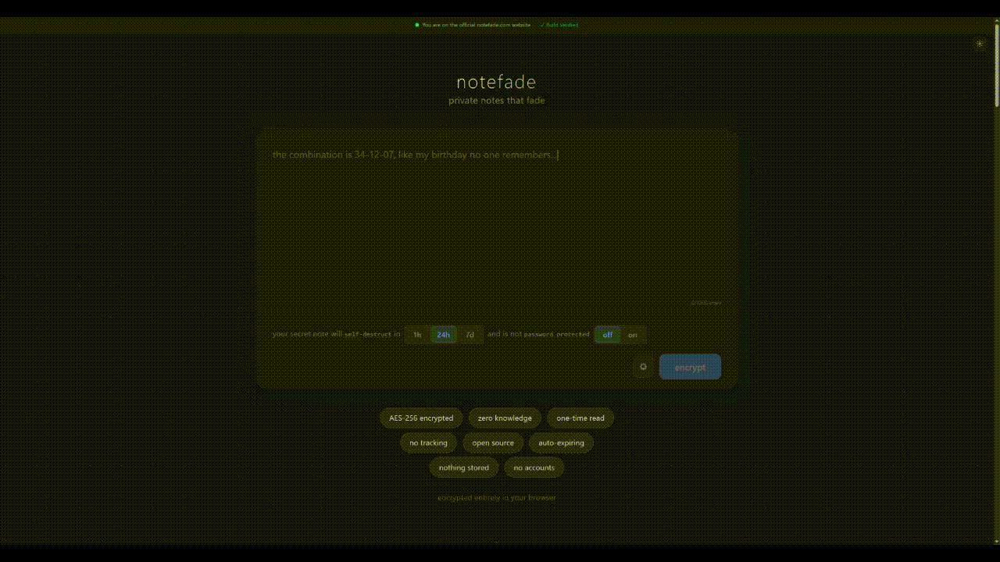

<h1 align="center">
  <br />
  
  <br />
  notefade.com - <em>Private notes that fade</em>
  <br />
</h1>

<p align="center">
  <a href="https://github.com/SaschaWebDev/notefade/actions/workflows/build.yml"></a>
  <a href="https://github.com/SaschaWebDev/notefade/actions/workflows/test.yml"></a>
  <a href="LICENSE"></a>
  <a href="https://www.typescriptlang.org/"></a>
  <a href="#-security-model"></a>
  <a href="https://workers.cloudflare.com/"></a>
</p>

<p align="center">
  
</p>

---

Self-destructing secret notes with zero-knowledge encryption. Create an encrypted note, get a one-time link, share it — the note is gone after a single read. The server never sees your content. Not even once.

Notefade splits your encryption key so the server stores only 16 meaningless bytes. Everything else lives in the URL fragment, which browsers never send to the server. No accounts. No cookies. No tracking. Just end-to-end encrypted, one-time-read secret sharing that you can self-host anywhere.

## ✨ Features

- 🔐 **AES-256-GCM encryption** — Web Crypto API only, zero external crypto dependencies
- 🔑 **XOR key splitting** — server stores just 16 bytes; each shard alone is an information-theoretic one-time pad, making reconstruction without both halves mathematically impossible regardless of computational power
- 🔗 **URL fragment architecture** — `#fragment` is never sent to the server, by design
- 💥 **One-time read** — shard is deleted the moment it's served
- ⏳ **Auto-expiring links** — 1 hour, 24 hours, or 7 days
- 🗝️ **Password protection** — optional PBKDF2 layer (600k iterations, SHA-256)
- 📱 **QR code sharing** — generate and export as PNG
- 🕵️ **Steganographic sharing** — hide your note link inside innocent-looking text (zero-width Unicode) or images (LSB pixel encoding)
- 🌗 **Dark / light theme** — auto-detects system preference, manual toggle to override
- ✍️ **Rich text editor** — formatting toolbar with bold, italic, headings, lists, code blocks, and links; notes render as markdown
- 📬 **Dead drop mode** — encrypt now, share an inert link, activate later via launch code
- 🕯️ **Burn-after-reading** — configurable fade timer (30 s, 1 min, 5 min, 15 min) clears the decrypted note from the browser
- 👁️ **Multi-read notes** — allow up to 10 reads before the note is gone
- 🔒 **Time-lock** — schedule when a note becomes readable with a live countdown
- 🧾 **Proof of read** — cryptographic HMAC receipt the sender can verify without knowing who read it
- 🃏 **Decoy links** — generate 1–3 extra encrypted notes with plausible alternate content for deniability
- 🧩 **7 backend adapters** — Cloudflare KV, Cloudflare D1, Upstash Redis, Vercel KV, Supabase, AWS DynamoDB, or your own API
- 🏠 **Self-hostable** — frontend and backend, no vendor lock-in
- 🔁 **Reproducible builds** — deterministic Docker builds, SHA-256 build manifests on every release
- 🛡️ **Subresource Integrity** — every script and stylesheet in production includes `integrity` attributes
- 👻 **No accounts, no cookies, no tracking** — anonymous by default
- 📖 **Open source** — MIT licensed

## ⚙️ How It Works

1. You write a note
2. The client encrypts it with AES-256-GCM (Web Crypto API)
3. The 32-byte encryption key is split via XOR into two shares
4. A 16-byte shard goes to the server (stored in KV with a TTL)
5. Everything else goes into the URL fragment: `notefade.com/#<id>:<payload>`
6. The recipient opens the link → client fetches the shard → server deletes it → client reconstructs the key → decrypts → done

```
URL fragment (#) — never sent to server:
  ├─ shard ID           → tells server which shard to fetch
  ├─ integrity check    → FNV-1a hash for tamper detection
  ├─ XOR share (48 B)   → meaningless without the server shard
  ├─ IV (12 B)          → safe to be public
  └─ ciphertext         → the encrypted note (padded to fixed length)

Server KV:
  └─ 16 bytes           → deleted after first read or TTL expiry
```

The server never has enough information to decrypt anything. Even if it's compromised, seized, or subpoenaed — there's nothing useful to hand over.

## 🛡️ Security Model

Notefade is designed so the server is never trusted with secrets.

**What the architecture protects against:**

- 🖥️ Server compromise — the shard alone can't decrypt anything
- 💾 Data breaches — no content is ever stored server-side
- ⚖️ Subpoenas / legal requests — there's nothing meaningful to produce
- 📡 Network surveillance — the URL fragment never leaves the browser
- 📏 URL length analysis — all links are padded to a fixed length regardless of message size
- ♻️ Link reuse — the shard is deleted after a single read

**What it does not protect against:**

- 📸 Screenshots or copy-paste by the recipient
- 🦠 Compromised devices (keyloggers, screen capture malware)
- 💾 A recipient intentionally saving the content

We're honest about this. Once someone reads a note, they have the plaintext. Notefade ensures only _one_ person reads it, and that the server is never in a position to.

**Security headers:** `no-referrer` policy, `no-store` cache headers, HTTPS-only in production, origin-locked CORS.

For a full technical breakdown, see [notefade.com/docs](https://notefade.com/docs).

## 🕵️ Steganographic Sharing

Two methods to disguise a note link so it doesn't look like a link at all.

### 📝 Hide in text (zero-width Unicode)

The URL is converted to binary, then encoded as invisible zero-width characters — `U+200B` (zero-width space) for `0`, `U+200C` (zero-width non-joiner) for `1`, and `U+200D` (zero-width joiner) as a separator — interleaved into cover text you provide.

The result looks like a normal sentence. The link is invisible to human eyes but recoverable by the decode page.

**Limitations:** Some apps strip zero-width characters on paste. If the recipient can't decode, send the link directly. The encoding is invisible to humans but detectable by tools inspecting Unicode codepoints.

### 🖼️ Hide in image (LSB steganography)

URL bits are written into the least-significant bit of each R, G, B channel (alpha is untouched). A 4-byte big-endian length header precedes the UTF-8 payload.

Two modes:

- **Generate** — creates random abstract art as the cover image
- **Upload** — use your own image as the cover

The image must have enough pixels to hold the URL data. The LSB changes are visually imperceptible.

### 📦 Download formats: PNG vs ZIP

Messengers (WhatsApp, Telegram, Signal, etc.) recompress images by default, which destroys LSB-encoded data.

- **PNG download** — use when sending as a file/document (e.g. WhatsApp's "send as document" or "original quality" mode), or over channels that don't recompress (email attachments, cloud storage links, AirDrop)
- **ZIP download** — wraps the PNG in a ZIP archive that messengers won't recompress. The recipient extracts the PNG and decodes it. Safest option for messenger sharing.

### 🎭 Anti-fingerprint filenames

Every download gets a randomized filename from 16 patterns (camera roll, screenshot, casual share, art/creative, social, etc.) using cryptographically random selection. An interceptor seeing the file cannot determine it came from notefade — filenames look like `IMG_20260303_142517.png`, `sunset_v2.png`, `from_alex_painting.png`, etc. No two downloads produce the same filename.

### 🔍 Decoding

The built-in `/decode` page extracts hidden links from both images and text. Drag-and-drop or file upload for images, paste for text.

## 🏠 Self-Hosting

### 🌐 Frontend

```bash
yarn build
```

Serve the `dist/` directory from any static host — Cloudflare Pages, Vercel, Netlify, Nginx, or a simple file server.

### ⚡ Backend

The default backend is a Cloudflare Worker with KV storage. Deploy your own:

```bash
yarn worker:deploy
```

Or use any of the 7 supported shard storage providers:

| Provider            | Type       | Notes                                             |
| ------------------- | ---------- | ------------------------------------------------- |
| **Cloudflare KV**   | `cf-kv`    | Default. Native TTL support.                      |
| **Cloudflare D1**   | `cf-d1`    | SQL-based alternative.                            |
| **Upstash Redis**   | `upstash`  | REST API, serverless Redis.                       |
| **Vercel KV**       | `vercel`   | Backed by Upstash.                                |
| **Supabase**        | `supabase` | Postgres-backed.                                  |
| **AWS DynamoDB**    | `dynamodb` | Via API Gateway.                                  |
| **Self-hosted API** | `self`     | Any server implementing the ShardStore interface. |

### 🔌 ShardStore Interface

Implement this interface and you can use any storage backend:

```typescript
interface ShardStore {
  put(id: string, shard: string, ttl: number): Promise<void>;
  get(id: string): Promise<string | null>; // fetch and delete
  exists(id: string): Promise<boolean>;
  delete(id: string): Promise<boolean>;
}
```

The `get` method must delete the shard after returning it (one-time read semantics).

When someone opens a note stored on a non-default server, notefade displays which provider holds the shard so users know what they're trusting.

## 🚀 Getting Started

### 📋 Prerequisites

- Node.js 22.14.0 (see `.nvmrc`)
- Yarn

### 💻 Development

```bash
# Clone the repo
git clone https://github.com/SaschaWebDev/notefade.git
cd notefade

# Install dependencies
yarn install

# Start the dev server (frontend)
yarn dev

# Start the worker (backend, separate terminal)
yarn worker:dev
```

The dev server proxies `/shard` requests to the local worker on port 8787.

### 🔨 Build & Test

```bash
# Type-check and build
yarn build

# Run tests
yarn test

# Run tests in watch mode
yarn test:watch
```

### 🧪 Testing

**468 unit tests** across 26 test suites (Vitest) covering cryptography, steganography, key splitting, receipt verification, URL encoding, decoy generation, ZIP building, time formatting, and random utilities. **9 end-to-end tests** (Playwright, Chromium) covering page routing, the create-note flow, full create-to-read roundtrip decryption, note-gone states, and password gate rendering.

```bash
# Run unit tests
yarn test

# Run E2E tests (auto-starts Vite dev server)
yarn test:e2e
```

### 📦 Production Build

```bash
yarn build:prod
```

Runs four steps: type-check → Vite build → SRI injection → build manifest generation. The output `dist/build-manifest.json` contains SHA-256 hashes of every file.

### ✅ Verifying Builds

You can verify that the code running on notefade.com matches this repository.

**With Docker** (most reliable — pins exact Node version and lockfile):

```bash
git checkout v0.1.0
yarn build:docker
# Compare dist-verify/build-manifest.json against the GitHub release manifest
```

**With the CLI script** (requires Node 22.14.0):

```bash
git checkout v0.1.0
yarn install --frozen-lockfile
yarn build:prod
node scripts/verify-build.cjs
```

The verify script fetches the build manifest from notefade.com, downloads every listed file, and compares SHA-256 hashes for self-consistency. It also verifies SRI integrity attributes on script and stylesheet tags. If a local build exists, it warns when Node versions or commits differ between local and remote. Tagged releases on GitHub include `build-manifest.json` as an artifact.

### 🚢 Deploy

```bash
# Deploy frontend to Cloudflare Pages
yarn deploy

# Deploy worker
yarn worker:deploy
```

If using Cloudflare Pages automatic builds (connected to GitHub), set `NODE_VERSION` to `22.14.0` in your Pages project settings (Settings → Environment variables). This ensures Cloudflare builds with the same Node version pinned in `.nvmrc`, which is required for reproducible builds and matching SRI hashes.

## 🧰 Tech Stack

| Layer         | Technology                                           |
| ------------- | ---------------------------------------------------- |
| Frontend      | React 19, TypeScript (strict), CSS Modules           |
| Build         | Vite 6                                               |
| Encryption    | Web Crypto API (AES-256-GCM, PBKDF2, XOR)            |
| Steganography | LSB image encoding, zero-width Unicode text encoding |
| Backend       | Cloudflare Workers + KV                              |
| Validation    | Zod                                                  |
| Testing       | Vitest, Playwright                                   |
| QR Codes      | qrcode-generator                                     |

## 📁 Project Structure

```
src/
├── api/              # Shard API client & 7 backend adapters
│   └── adapters/     # cloudflare-kv, d1, upstash, supabase, dynamodb, self-hosted
├── components/       # React UI (CreateNote, ReadNote, NoteLink, QrCode, ...)
│   └── docs/         # Documentation pages
├── crypto/           # AES-256-GCM, XOR key splitting, PBKDF2, steganography (LSB + zero-width)
├── hooks/            # useCreateNote, useReadNote, useHashRoute, ...
└── styles/           # CSS variables & animations

worker/
└── index.ts          # Cloudflare Worker (shard CRUD + rate limiting)
```

## 📡 API

Six endpoints. That's the entire backend.

| Method   | Endpoint          | Description                      |
| -------- | ----------------- | -------------------------------- |
| `POST`   | `/shard`          | Store a shard (returns ID)       |
| `HEAD`   | `/shard/:id`      | Check if a shard exists          |
| `GET`    | `/shard/:id`      | Fetch and delete a shard         |
| `DELETE` | `/shard/:id`      | Destroy a shard without reading  |
| `POST`   | `/shard/defer`    | Create a defer token (dead drop) |
| `POST`   | `/shard/activate` | Activate a deferred note         |

Rate limited per IP. Max request body: 1 KB. Full API docs at [notefade.com/docs](https://notefade.com/docs).

### ⚠️ Third-Party Integration API

> **Security tradeoff:** This endpoint does NOT follow the zero-knowledge model. The server briefly sees plaintext (~1-2ms in volatile Worker memory) before encrypting. Never stored, never logged — but the server processes content, which the main application never does. Use the main app for sensitive secrets.

| Method | Endpoint              | Description                            |
| ------ | --------------------- | -------------------------------------- |
| `POST` | `/api/v1/create-note` | Create a note (server-side encryption) |

Requires an `X-Api-Key` header. Rate limited per key (60 req/min, KV-based). Max body: 4 KB. Fixed 24-hour TTL.

This is a convenience endpoint for trusted third-party apps that need to create notes programmatically. It produces the same encrypted output as the main app — AES-256-GCM, XOR key splitting, one-time-read — but encryption happens on the server instead of in the browser. See [notefade.com/docs#integration-api](https://notefade.com/docs#integration-api) for full documentation and security details.

## 📄 License

MIT — Sascha Majewsky
